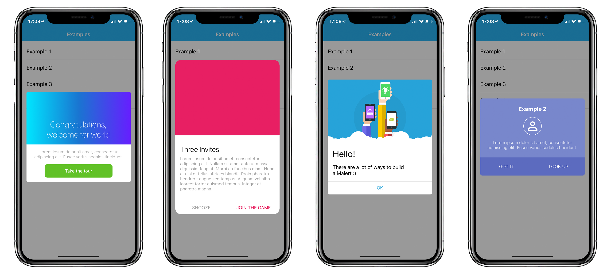

<div style="text-align: center"> 
	
</div>

[](http://cocoapods.org/pods/Malert)
[](http://cocoapods.org/pods/Malert)
[](http://cocoapods.org/pods/Malert)

## A simple, easy and custom iOS UIAlertView written in Swift 

<div style="text-align: center"> 
	
</div>

Malert came to facilitates custom alert views as `UIAlertController`. Malert allows you to personalize your alertView so that it matches your application layout

To run the example project, clone the repo, and run `pod install` from the Example directory first.

## Requirements

- Xcode 10.0+
- Swift 4.0+

## Versioning

- *Swift 3.x*: 1.1.5
- *Swift 4.0*: 2.0~3.0
- *Swift 4.2*: 3.1*
- *Swift 5*: 4.0+

## Installation

### Pod

Malert is available through [CocoaPods](http://cocoapods.org). To install
it, simply add the following line to your Podfile:

```ruby
pod 'Malert'
```
### Manually

If you don't use any dependency managers, you can integrate Malert in your project manually just adding the files which contains [Malert Classes](https://github.com/vitormesquita/Malert/tree/master/Malert/Classes). 

Congratulations!!! You can run Malert without any dependency managers!

## Example

This is a simple example. If you want to know more, check the app Example cause There are more than 10 customizated Malerts.

<!--### Default Malert with title

```swift
import Malert

...
	
TODO
	
...
	
```-->

### Malert with custom view

```swift
import Malert

...

let view = ExampleView.instantiateFromNib()
let malert = Malert(customView: view)

let action = MalertAction(title: "OK")
action.tintColor = UIColor(red:0.15, green:0.64, blue:0.85, alpha:1.0)

malert.addAction(action)

present(malert, animated: true)
```

### How to create actions 

To add buttons to your malert There is a function called `addAction` that you need to provide a `MalertAction` object to build customizable buttons.

```swift
let malert = ... 
   	 
let action = MalertAction(title: "Take the tour") {
   print("Closure called when action was clicked")
}

action.cornerRadius = 8
action.tintColor = .white
action.backgroundColor = UIColor(red:0.38, green:0.76, blue:0.15, alpha:1.0)

malert.addAction(action)
	
...
```

**For more details check the examples**

## Customize

Malert provides some attributes to cutomize it:

```swift
/* Animation attr */
public var presentDuration: TimeInterval
public var dismissDuration: TimeInterval
public var animationType: MalertAnimationType

/* Container attr */
public var margin: CGFloat
public var cornerRadius: CGFloat
public var backgroundColor: UIColor?

/* Title attr */
public var titleFont: UIFont
public var textColor: UIColor
public var textAlign: NSTextAlignment

/* Buttons attr */
public var buttonsHeight: CGFloat
public var separetorColor: UIColor
public var buttonsSpace: CGFloat
public var buttonsSideMargin: CGFloat
public var buttonsBottomMargin: CGFloat
public var buttonsAxis: UILayoutConstraintAxis
```

It is very simple how you can do that. Just change malert's attributes ***before*** present it:

```swift
let exampleView = ExampleView()

let alert = Malert(customView: exampleView)

//customizing your malert

alert.animationType = .modalRight
alert.buttonsSideMargin = 60
alert.buttonsBottomMargin = 16
alert.buttonsAxis = .horizontal
alert.separetorColor = .clear
```

#### Customize actions

Malert enable some attributes to customize each action:

```swift
public var tintColor: UIColor
public var backgroundColor: UIColor
public var cornerRadius: CGFloat
public var borderColor: UIColor
public var borderWidth: CGFloat
```
If you need more attributes to customize it, please let us know, create an issue or a pull request. 

## Contributing
	
If you think that we can do the Malert more powerful please contribute with this project. And let's improve it to help other developers.

Create a pull request or let's talk about something in issues. Thanks a lot.

## Author

Vitor Mesquita, vitor.mesquita09@gmail.com

## License

Malert is available under the MIT license. See the LICENSE file for more info.

### [CHANGELOG](https://github.com/vitormesquita/Malert/blob/master/CHANGELOG.md)
